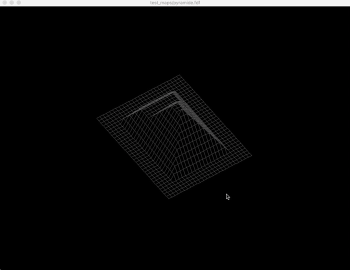

# map-visualizer #

A 3D height-map renderer with additional features including: rotation, zooming in/out, moving around the map and adjusting height.

## How to run ##

Clone this repository and run *make* in the root. Then execute the compiled binary *./fdf filename* . filename will be the the map that you want to project(e.g., *./fdf test_maps/pyramide.fdf*)
The **test_maps** folder contains some sample maps but you can add additional ones if you wish.

## controls ##
- :arrow_up: move up
- :arrow_backward: move left
- :arrow_forward: move right
- :arrow_down:move down
- click and drage mouse: rotate
- i key: zoom in
- o key: zoom out
- \+ key: increase height
- \- key: decrease height
